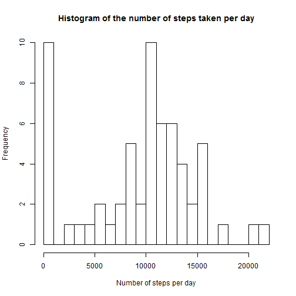
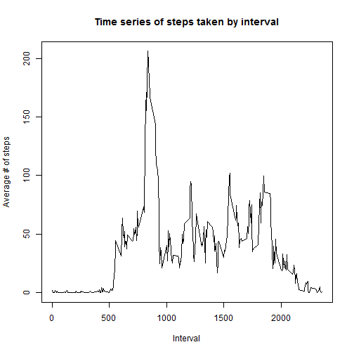
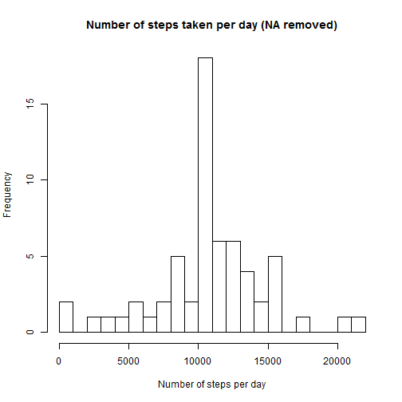
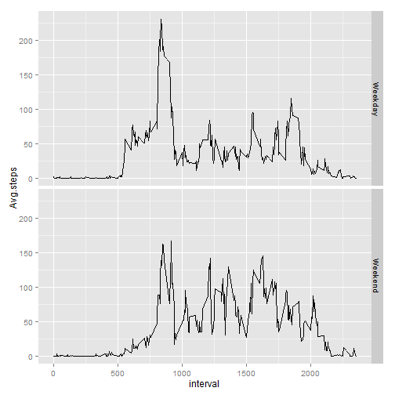

#Reproducible Research - Assignment 1

============================================

###Loading and processing the data to dplyr format


```r
setwd("~/Coursera/C5 Reproducible Research/Assignment_1/RepData_PeerAssessment1")
data <- read.csv('activity.csv')
library(dplyr)
data_df <- tbl_df(data)
```

###What is mean total number of steps taken per day?


```r
data_bydate <- group_by(data_df,date)
summ_bydate <- summarize(data_bydate, Sum.steps = sum(steps,na.rm = TRUE))

hist(summ_bydate$Sum.steps, breaks = 20,
     main = 'Histogram of the number of steps taken per day',
     xlab = 'Number of steps per day',
     ylab = 'Frequency')
```

 

```r
mean(summ_bydate$Sum.steps)
```

```
## [1] 9354.23
```

```r
median(summ_bydate$Sum.steps)
```

```
## [1] 10395
```

###What is the average daily activity pattern?


```r
data_byint <- group_by(data_df,interval)
summ_byint <- summarize(data_byint, Avg.steps = mean(steps,na.rm = TRUE))

plot(summ_byint$interval,summ_byint$Avg.steps,
     type = 'l',
     main = 'Time series of steps taken by interval',
     xlab = 'Interval',
     ylab = 'Average # of steps')
```

 
Finding the interval with max steps

```r
summ_byint$interval[which.max(summ_byint$Avg.steps)]
```

```
## [1] 835
```

###Imputing missing values

How many missing values

```r
data_na <- is.na(data)
table(data_na)[2]
```

```
## TRUE 
## 2304
```

Filling in missing values
The NAs are filled in with the mean number of steps at that interval over all
the days.

```r
data_df$steps <- as.numeric(data_df$steps)
data_filled <- data_df %>% 
        group_by(interval) %>% 
        mutate(steps= ifelse(is.na(steps), mean(steps, na.rm=TRUE), steps))
```

Looking at data

```r
data_bydate2 <- group_by(data_filled,date)
summ_bydate2 <- summarize(data_bydate2, Sum.steps = sum(steps))

hist(summ_bydate2$Sum.steps, breaks = 20,
     main = 'Number of steps taken per day (NA removed)',
     xlab = 'Number of steps per day',
     ylab = 'Frequency')
```

 

The mean and the median for the NAs filled in

```r
mean(summ_bydate2$Sum.steps)
```

```
## [1] 10766.19
```

```r
median(summ_bydate2$Sum.steps)
```

```
## [1] 10766.19
```
The mean and the median for the NAs=0

```r
mean(summ_bydate$Sum.steps)
```

```
## [1] 9354.23
```

```r
median(summ_bydate$Sum.steps)
```

```
## [1] 10395
```
Imputing missing data has shifted the averages up since the zero values are not 
so swaying it. 

###Are there differences in activity patterns between weekdays and weekends?

Create a factor variable to distinguish betweek weekday and weekend date and 
then summarize by average steps per interval

```r
data_filled$date <- as.Date(data_filled$date)
        
data_filled <- data_filled %>% 
        mutate(day_type = as.factor(ifelse(
                weekdays(date)%in% c("Saturday","Sunday"),
                "Weekend","Weekday")))

data_byint2 <- group_by(data_filled,interval,day_type)
summ_byint2 <- summarize(data_byint2, Avg.steps = mean(steps))

library(ggplot2)
ggplot(summ_byint2, aes(interval, Avg.steps)) +
        geom_line()+
        facet_grid(day_type~.)
```

 


